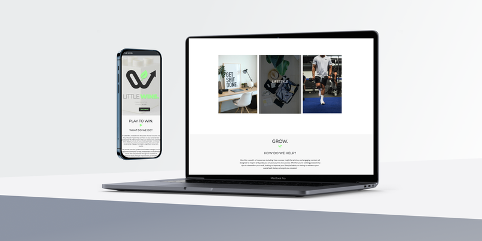
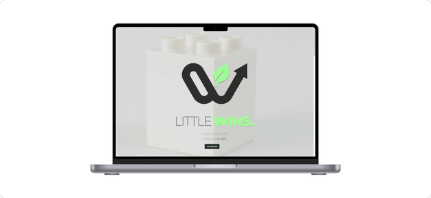
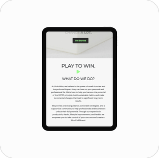
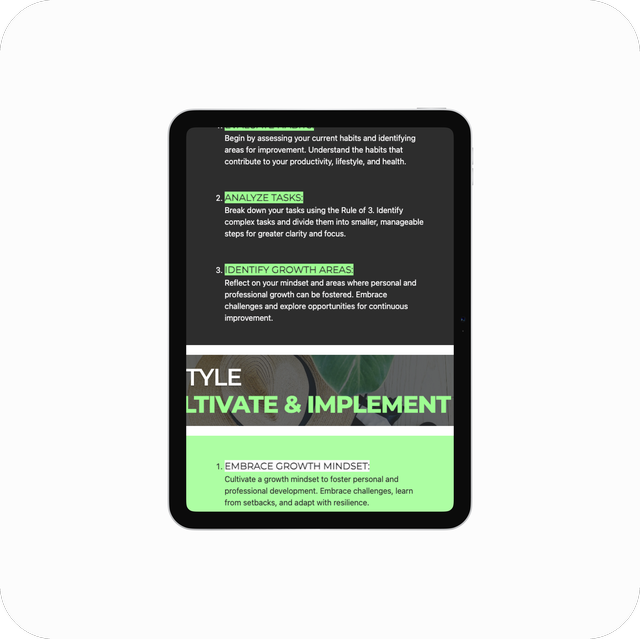
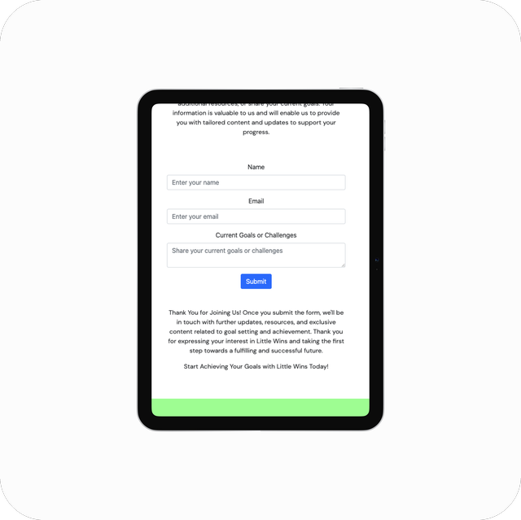

# Little Wins Marketing Website

This is the main marketing website for Little Wins, a platform designed to help individuals achieve their goals and make positive changes in their lives. The website is responsibe and accessible on a range of devices, making it easy for users to navigate and find valuable content.

## User Experience (UX)

### User Stories

#### First Time Visitor Goals

- As a First Time Visitor, I want to easily understand the main purpose of the site and learn more about Little Wins.
- As a First Time Visitor, I want to be able to navigate throughout the site to find relevant content and resources.
- As a First Time Visitor, I want to look for testimonials and social media links to gauge the credibility and reputation of Little Wins.

#### Returning Visitor Goals

- As a Returning Visitor, I want to revisit Little Wins values and purposes.
- As a Returning Visitor, I want to easily get in touch with Little Wins for any inquiries.
- As a Returning Visitor, I want to check Little Wins updated resources and helpful steps.

#### Frequent User Goals

- As a Frequent User, I want to check to see if there are any newly added resources for goal achieving or new processes.
- As a Frequent User, I want to check to see if there are any new changes to Little Wins recommended process.
- As a Frequent User, I want to sign up to Little Wins community events to stay updated with like-minded individuals.

### Design

#### Colour Scheme

The website primarily uses a combination of vibrant colors, including the Little Wins mint, grey and white to create an energetic and engaging visual experience.

- mint - #98FF98
- greys - #333
- white - #fefefe

A mixture of all the above colours were used throughout the site.

#### Typography

The main font used throughout the website is Montserrat, with Sans Serif as the fallback font. Montserrat is a clean and modern font that adds to the overall aesthetic and readability of the content.

Montserrat is also the font for Little Wins logo, keeping the brand consisten throughout.

#### Imagery

The website incorporates captivating and relevant imagery, including a large background hero image, to create visual appeal and draw the user's attention. Also use of quotes and images to engage users experience. All designs were designed by me, however I used Unsplash to source the stock images used on the website.

#### Wireframes

- # Home Page

- # Mobile

- # Goals/Contact Page

## Features

- Responsive design for optimal viewing on all device sizes.
- Interactive elements to enhance user engagement.
- Consistent theme with nav bar, sections and media/media links.

## Technologies Used

### Languages Used

- HTML5
- CSS3
- VSCode
- Github
- Github Pages
- W3Schools
- Figma
- Adobe Suite

### Frameworks, Libraries & Programs Used

- Bootstrap 4.4.1: Used for responsive design and styling.
- Hover.css: Used for hover effects on social media icons.
- Google Fonts: Imported the "Montserrat" font for consistent typography.
- Figma: Used to design the sites visuals.
- Font Awesome: Used for icons throughout the website.
- jQuery: Used for responsive navigation and smooth scroll functionality.
- Git: Version control and collaboration.
- GitHub: Repository hosting and deployment.
- Photoshop: Used for Image editing and optimization.
- Balsamiq: Wireframe design.

## Testing

- Validated the HTML and CSS code using W3C validators.
    - Initially the site was recieving a lot of errors due to an outdated Font awesome link.
    - I struggled with trying to import JS Font awesome, however managed to stick it through and get the issue resolved.

- Tested the website on various browsers and devices with various individuals.
    - Similar issue with Lighthouse. Lighthouse scores were poor, managed to score better when switching to incognito mode. Chrome extensions had an affect on website's performance score.

- Conducted user testing with friends and family members.
    - Users enjoyed the sites visuals however later found out that the visuals were taking too much space and were too large. This resulted into compressing the image files which led to the decrease in somme image quality.

## Deployment

The website is deployed using GitHub Pages, which hosts the project directly from the GitHub repository. Changes made to the repository are automatically reflected on the live site.

- Getting into the habit of commenting when submitting any changes to the site allowed me to better document the changes I made when creating the site. 
- Using terminal to pull and push my repository.

# Home:
- The first page created was the Home page as I believe it was the most important as it's the first page someone see when checking out a website. The banner used in the header section of the Home page is designed to be responsive depending on different devices.

    - I tested out the Homepage with 3 individuals. Each individual was excited to find out more about the brand and enjoyed how Little Wins navigation was different from other sites making them intrigued to check all the pages out. 
    - The first individual to test the site realised it took a while too load, I assumed it was there internet connection however later found out with using lighthouse that the image files we're too large especially the main banner. 
    - The main banner's resolution was sacrificed in order to get the a better lighthouse score.
    - The banner in place now is a good resolution for Laptop screens, 13-15inchs, however when using a high resolution Desktop you are able to see the pixelation.
    - The home page continue to introduce the brand to new and existing users, again with a thought provoking Title. 
    - Moving down the page, it follows a steps process which theme is carried on throughout the Website journey. (A user mentioned this whilst testing) maintaining the rule of 3, one of the Brand's main values.
    - Including a great quote by a respectable historical figure, to help users who are just quickly browsing to understand the Little Win's brand values.
    - Finishing off with the brand's values and mission statements, giving more details about the brand, followed by a Join the Community section to lead users to other spaces where Little Wins is available to be contacted.

# Process:
- The Process page aims to touch more on the idea of Little Wins and what it represents. Little Wins represents breaking tasks into smaller digestiable tasks in order to achieve more, whether that be in business or with professionals.

    - The process page is to continue and break down the brands Visions and Missions which ended on the Home page.
    - Starting off with the Brand's Values and Mission on this page was to allow users to be briefly recapped on what Little Wins the brand focuses on achieving and how the brand's values can help achieve this. 
    - Again with more useful information on tips and tricks to help new users, and frequent users keep up to date with suggested approaches to tacking individual or business goals.
    - The 3 step process contiues Little Brand's theme of simplicity using the rule of 3 to break down the steps. 
    - Including the theme of finishing the page with an oppurtunity for new and frequent users to keep up with the Little Win's brand community via Social Media.

# Goals:
- The Goals page 
    - The goals page aims to have a goal of getting individuals to reachout to Little Wins to learn more and get in contact with the team.
    - I used accessibility for less abled users to help with the navigation of all pages, indicating which sections are which and giving them a brief description for all section.
    - The contact form at the bottom acts also as a query section to allow users to directly contact Little Wins via the website.
    - Finishing off with the Join the Community section which acts as a footer through out the whole site.

## Credits
- Code Institute: Provided support and guidance throughout the project. Special thank you to Iris for the on-going support.
- Bootstrap: Used the Bootstrap library for responsive design.
- Font Awesome: Used for icons.

### Code

- The full-screen hero image code came from this StackOverflow post. 

- Bootstrap 4: Bootstrap Library used throughout the project mainly to make the site responsive using the Bootstrap Grid System.

### Content

All content was written by the developer.

### Media

All images were created by the developer.
## Home - About page

## Process - Second page

## Goals - Contact and Resources page

### Acknowledgements

- My Mentor for continuous helpful feedback.
- Tutor support at Code Institute for their support.

